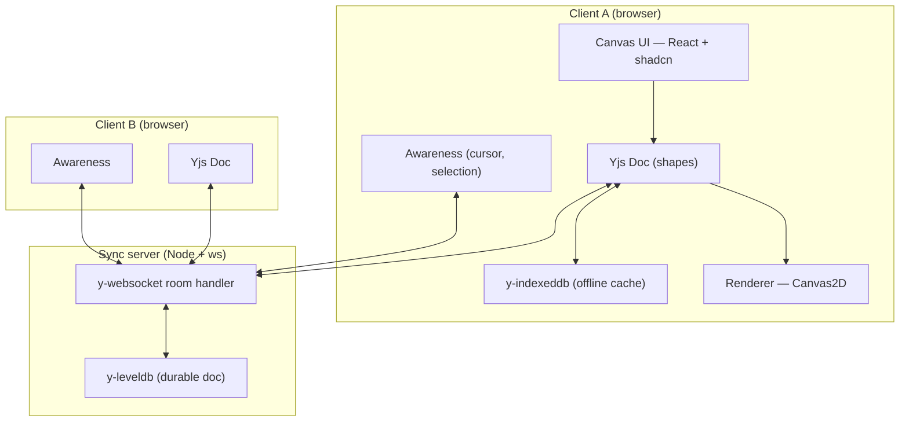

# Cofield

**A multi-team infinite canvas that stays convergent across clients — built on CRDTs, not a database race.** Open the same board in two tabs, draw in one, watch it appear in the other instantly. Go offline, keep editing, reconnect — the edits merge with zero data loss. No central server transforms your operations; every client holds a full, self-healing copy of the document.

<!-- Badges: wire these to the real repo once published. -->
[](.github/workflows/ci.yml)
[](LICENSE)
[](#)

<!--
HERO MEDIA — replace with a 5-12s muted autoplay loop:
split-screen, two browser windows, a shape drawn in one appears in the other,
ghost cursors moving. This is the single highest-leverage asset in the repo.
Drop the file in docs/media/ and reference it here.
-->
> _Hero loop lands in `docs/media/` — two windows, shapes syncing live, cursors flying._

**[Live demo](#) · [90-second walkthrough](#)** — open the demo board, then open it again in a second tab. You're now multiplayer with yourself.

---

## The problem

Realtime collaboration is where naive implementations quietly lose data. Last-write-wins clobbers concurrent edits — two people nudge the same shape, one of them silently loses. A central server that transforms every operation (OT) is famously hard to get right and couples every client to one authority. The hard version — convergent state across N clients, correct under concurrency, and tolerant of going offline — is the entire point of this project.

Cofield treats the **document as a replicated CRDT**, not as rows behind a lock. The server is a relay and a durable store, never an arbiter. Each shape is a per-field CRDT map, so one person moving a sticky and another recoloring it merge cleanly instead of fighting.

## Architecture

The Yjs document is the source of truth and it is **replicated, not centralized**. The sync server relays binary diffs and persists them; it never transforms operations. Cursors and selections ride the same socket on a separate **ephemeral** channel that is never written to disk — a cursor position has no business in the persistent document.



Full system design, the edit-propagation sequence, and the multi-team data model live in **[docs/ARCHITECTURE.md](docs/ARCHITECTURE.md)**.

## Key technical decisions

- **CRDT (Yjs) over operational transform or last-write-wins.** OT needs a correct central transform server; LWW silently drops concurrent edits. Yjs converges deterministically with no central authority and is offline-first. The cost is honest — the document accumulates tombstones — so snapshotting and GC are designed in, not pretended away.
- **Per-field nested `Y.Map` per shape, not one object in a flat map.** Two users editing *different fields of the same shape* (one moves it, one recolors it) merge without clobbering. This granularity is the difference between "uses a CRDT lib" and "understands CRDTs."
- **Awareness protocol for cursors, kept out of the document.** Presence is ephemeral and high-frequency; persisting it would bloat the doc and replay stale cursors on load. It rides the socket on a separate channel, throttled and never saved.
- **Self-hosted `y-websocket` (Node `ws`) over a managed service.** Running the protocol myself demonstrates I understand it rather than hiding behind a SaaS. The provider sits behind an interface, so swapping to PartyKit/Liveblocks later is a one-file change.
- **Canvas2D now, WebGL behind a `Renderer` interface.** Canvas2D ships the MVP; viewport culling and world/screen separation are designed so a WebGL renderer drops in for 10k+ shapes without touching tool or geometry code.

## Features

**Canvas & viewport** — infinite pan/zoom with a world coordinate system independent of the viewport; viewport culling so only visible shapes repaint.
**Shapes & tools** — rectangle, ellipse, line/arrow, freehand, sticky note, text; a tool state machine for select/draw/pan.
**Selection & transform** — single + marquee multi-select, move, resize handles, delete, z-order — all in world space, correct at any zoom.
**Realtime sync** — every change propagates to all clients, conflict-free, via Yjs binary diffs.
**Presence** — live multiplayer cursors with names and stable colors, selection tints ("Sara is editing this shape"), an active-user avatar stack.
**Offline & persistence** — edit while disconnected; reconnect and merge cleanly. Server-side leveldb means boards survive a restart.
**Rooms & multi-team** — a board is a room joined by URL; Org → Team → Board with scoped presence and per-board roles (v1).

The exhaustive spec — every state, shortcut, edge case, and acceptance criterion — is in **[docs/FEATURES.md](docs/FEATURES.md)**.

## Run locally

Requires Node 24+ and [pnpm](https://pnpm.io). Cofield is two processes: the Next.js web app and the Yjs sync server.

```bash
git clone <repo-url> cofield && cd cofield
cp .env.example .env.local
pnpm install

# terminal 1 — the sync server (ws + leveldb)
pnpm sync

# terminal 2 — the web app
pnpm dev
```

Open <http://localhost:3000>, create a board, then open the same board URL in a second tab — you're multiplayer.

### One command with Docker

```bash
docker compose up
```

This builds the `web` and `sync` services and wires them together. The sync server's leveldb store is a named volume (`canvas-data`), so your boards survive `docker compose restart`. Open <http://localhost:3000> in two tabs to see it.

## Tech stack

| Layer | Choice |
| --- | --- |
| Framework | Next.js (App Router) + TypeScript |
| Sync engine | Yjs (CRDT) |
| Transport | `y-websocket` over Node `ws` (self-hosted) |
| Presence | Yjs Awareness protocol |
| Persistence | `y-leveldb` (server) · `y-indexeddb` (client offline cache) |
| Rendering | Canvas2D (WebGL-designed-for) |
| Local UI state | Zustand |
| UI kit | shadcn/ui, re-themed bright + tactile |
| Tests | Vitest (deterministic CRDT-merge + geometry) |

## Roadmap

Shipped, in-progress, and the explicit cut lines (what was deliberately deferred and why) are in **[docs/ROADMAP.md](docs/ROADMAP.md)**.

## Contributing

See [CONTRIBUTING.md](CONTRIBUTING.md). Issues use the templates in `.github/ISSUE_TEMPLATE/`.

## License

MIT © 2026 Zana Salimi — see [LICENSE](LICENSE).
