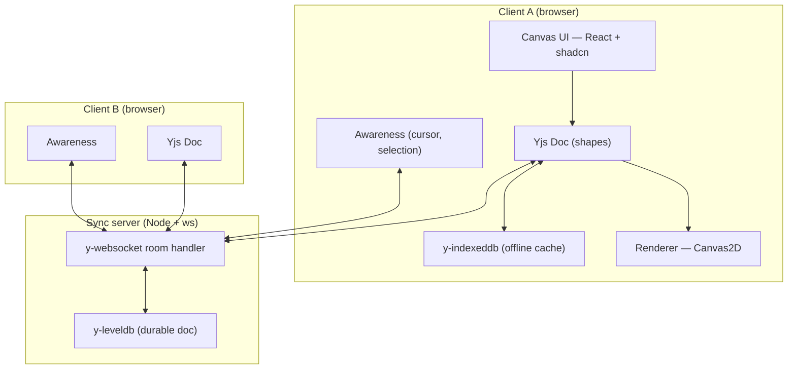

# Cofield

**An infinite collaborative canvas built on CRDTs.** Open the same board in two tabs, draw in one, and it shows up in the other right away. Keep editing while offline; when you reconnect, both sides merge without losing edits. The server only relays and stores updates — every client keeps a full copy of the document, so there's no central state for clients to fall out of sync with.

<!-- Badges: wire these to the real repo once published. -->
[](.github/workflows/ci.yml)
[](LICENSE)
[](#)


<!-- A short muted screen-capture loop (two windows syncing live) would land here too; the still above is generated from the in-app template gallery. -->

**[Live demo](#) · [90-second walkthrough](#)** — open the demo board, then open it again in a second tab. You're now multiplayer with yourself.

---

## The problem

Realtime editing is easy to get wrong. Last-write-wins drops concurrent edits: two people drag the same shape and one change disappears. Operational transform avoids that, but it needs a central server to rewrite every operation against the others — hard to implement correctly, and it ties every client to one authority. Getting this right across many clients, under concurrency, and through a disconnection is the part worth building.

Cofield stores the board as a CRDT (Yjs). The server relays and persists binary updates; it never rewrites them, and it isn't the source of truth — every client holds a full copy. Each shape is a small map of independent fields, so one person moving a shape and another recoloring it both apply.

## Architecture

The Yjs document is replicated to every client; no central copy arbitrates between them. The sync server relays binary updates and persists them, nothing more. Cursors and selections travel over the same socket on a separate awareness channel and are never written to disk — they're transient, so persisting them would only bloat the document and replay stale positions on the next load.



Full system design, the edit-propagation sequence, and the multi-team data model live in **[docs/ARCHITECTURE.md](docs/ARCHITECTURE.md)**.

## Key technical decisions

- **Yjs (CRDT), not operational transform or last-write-wins.** Last-write-wins drops concurrent edits; OT needs a correct central transform server. Yjs converges without a central authority and works offline. The tradeoff is that the document accumulates tombstones, which is why snapshotting and GC are part of the design rather than an afterthought.
- **A nested `Y.Map` per shape, one key per field.** When two people edit different fields of the same shape — one moves it, one recolors it — both edits land, because each field is an independent register instead of a single value the last writer overwrites.
- **Cursors on the Awareness channel, not in the document.** Presence is high-frequency and disposable. Keeping it in the document would grow the doc and replay stale cursors on load, so it rides the same socket on a separate channel, throttled, and is never persisted.
- **Self-hosted `y-websocket` (Node `ws`) instead of a managed service.** Running the protocol directly keeps the stack self-hostable with no third-party dependency. The provider sits behind an interface, so moving to PartyKit or Liveblocks later is a single-file change.
- **Canvas2D now, with a `Renderer` interface for WebGL later.** Canvas2D covers the MVP. World/screen separation and viewport culling are already in place, so a WebGL renderer can take over for large boards (10k+ shapes) without touching the tools or geometry.

## Features

**Canvas & viewport** — infinite pan/zoom with a world coordinate system independent of the viewport; viewport culling so only visible shapes repaint.
**Shapes & tools** — rectangle, ellipse, line/arrow, freehand, sticky note, text; a tool state machine for select/draw/pan.
**Selection & transform** — single + marquee multi-select, move, resize handles, delete, z-order — all in world space, correct at any zoom.
**Realtime sync** — every change propagates to all clients, conflict-free, via Yjs binary diffs.
**Presence** — live multiplayer cursors with names and stable colors, and an active-user avatar stack you can click to follow someone's viewport.
**Offline & persistence** — edit while disconnected; reconnect and merge cleanly. Server-side leveldb means boards survive a restart.
**Rooms & access** — each board is a room joined by URL, gated by membership, with per-board roles (owner / editor / viewer) enforced at the sync relay, not just in the UI. Org → Team scoping is on the roadmap.

The full feature spec — states, shortcuts, and edge cases — is in **[docs/FEATURES.md](docs/FEATURES.md)**.

## Run locally

Requires Node 24+ and [pnpm](https://pnpm.io). Cofield is two processes: the Next.js web app and the Yjs sync server.

```bash
git clone <repo-url> cofield && cd cofield
cp .env.example .env.local
pnpm install

# terminal 1 — the sync server (ws + leveldb)
pnpm sync

# terminal 2 — the web app
pnpm dev
```

Open <http://localhost:3000>, create a board, then open the same board URL in a second tab — you're multiplayer.

### One command with Docker

```bash
docker compose up
```

This builds the `web` and `sync` services and wires them together. The sync server's leveldb store is a named volume (`canvas-data`), so your boards survive `docker compose restart`. Open <http://localhost:3000> in two tabs to see it.

## Tech stack

| Layer | Choice |
| --- | --- |
| Framework | Next.js (App Router) + TypeScript |
| Sync engine | Yjs (CRDT) |
| Transport | `y-websocket` over Node `ws` (self-hosted) |
| Presence | Yjs Awareness protocol |
| Persistence | `y-leveldb` (server) · `y-indexeddb` (client offline cache) |
| Rendering | Canvas2D (WebGL-designed-for) |
| Local UI state | Zustand |
| UI kit | shadcn/ui, re-themed bright + tactile |
| Tests | Vitest (deterministic CRDT-merge + geometry) |

## Roadmap

Shipped, in-progress, and the explicit cut lines (what was deliberately deferred and why) are in **[docs/ROADMAP.md](docs/ROADMAP.md)**.

## Contributing

See [CONTRIBUTING.md](CONTRIBUTING.md). Issues use the templates in `.github/ISSUE_TEMPLATE/`.

## License

MIT © 2026 Zana Salimi — see [LICENSE](LICENSE).
