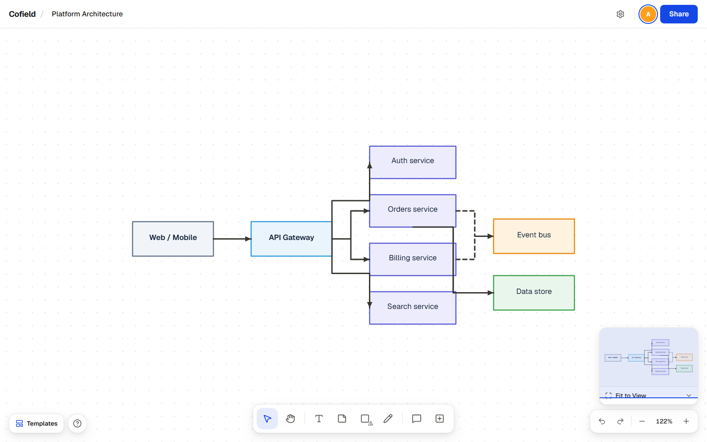
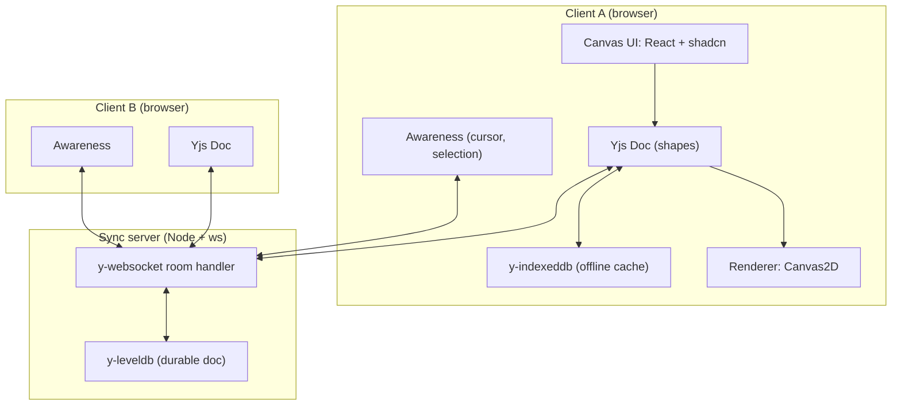

# Cofield

**An infinite collaborative canvas built on CRDTs.** Open the same board in two tabs, draw in one, and it shows up in the other right away. Keep editing while offline; when you reconnect, both sides merge without losing edits. The server only relays and stores updates. Every client keeps a full copy of the document, so there's no central state to fall out of sync with.

[](https://github.com/zanasalimi/cofield/actions/workflows/ci.yml)
[](LICENSE)
[](https://codespaces.new/zanasalimi/cofield)



**Live demo.** Open the repo in a [GitHub Codespace](https://codespaces.new/zanasalimi/cofield). It installs the dependencies and starts both the web app and the sync server (or run `pnpm demo` yourself). When the app opens, create a board, then open the same URL in a second tab to be multiplayer with yourself.

---

## The problem

Realtime editing is easy to get wrong. Last-write-wins drops concurrent edits: two people drag the same shape and one change disappears. Operational transform avoids that, but it needs a central server to rewrite every operation against the others — hard to implement correctly, and it ties every client to one authority. Getting this right across many clients, under concurrency, and through a disconnection is the part worth building.

Cofield stores the board as a CRDT (Yjs). The server relays and persists binary updates; it never rewrites them, and it isn't the source of truth. Every client holds a full copy. Each shape is a small map of independent fields, so one person moving a shape and another recoloring it both apply.

## Architecture

The Yjs document is replicated to every client; no central copy arbitrates between them. The sync server relays binary updates and persists them, nothing more. Cursors and selections travel over the same socket on a separate awareness channel and are never written to disk. They're transient, so persisting them would only bloat the document and replay stale positions on the next load.



Full system design and the edit-propagation sequence are in **[docs/ARCHITECTURE.md](docs/ARCHITECTURE.md)**.

## Key technical decisions

- **Yjs (CRDT), not operational transform or last-write-wins.** Last-write-wins drops concurrent edits; OT needs a correct central transform server. Yjs converges without a central authority and works offline. The tradeoff is that the document accumulates tombstones, which is why snapshotting and GC are part of the design rather than an afterthought.
- **A nested `Y.Map` per shape, one key per field.** When two people edit different fields of the same shape, one moving it and one recoloring it, both edits land, because each field is an independent register instead of a single value the last writer overwrites.
- **Cursors on the Awareness channel, not in the document.** Presence is high-frequency and disposable. Keeping it in the document would grow the doc and replay stale cursors on load, so it rides the same socket on a separate channel, throttled, and is never persisted.
- **Self-hosted `y-websocket` (Node `ws`) instead of a managed service.** Running the protocol directly keeps the stack self-hostable with no third-party dependency. The provider sits behind an interface, so moving to PartyKit or Liveblocks later is a single-file change.
- **Canvas2D now, with a `Renderer` interface for WebGL later.** Canvas2D covers the MVP. World/screen separation and viewport culling are already in place, so a WebGL renderer can take over for large boards (10k+ shapes) without touching the tools or geometry.

## Features

**Canvas & viewport.** Infinite pan/zoom with a world coordinate system independent of the viewport; viewport culling so only visible shapes repaint.
**Shapes & tools.** Rectangle, ellipse, line/arrow, freehand, sticky note, text, plus connectors and frame/table/code components; a tool state machine for select/draw/pan.
**Selection & transform.** Single and marquee multi-select, move, resize, rotate, align, distribute, z-order, lock, all in world space and correct at any zoom.
**Realtime sync.** Every change propagates to all clients, conflict-free, via Yjs binary diffs.
**Presence.** Live multiplayer cursors with names and stable colors, and an active-user avatar stack you can click to follow someone's viewport.
**Offline & persistence.** Edit while disconnected, then reconnect and merge cleanly. Server-side leveldb means boards survive a restart.
**Rooms & access.** Each board is a room joined by URL, gated by membership, with per-board roles (owner, editor, viewer) enforced at the sync relay, not just in the UI.

The full feature spec, with states, shortcuts, and edge cases, is in **[docs/FEATURES.md](docs/FEATURES.md)**.

## Run locally

Requires Node 24+ and [pnpm](https://pnpm.io). Cofield is two processes: the Next.js web app and the Yjs sync server.

```bash
git clone <repo-url> cofield && cd cofield
cp .env.example .env.local
pnpm install

# terminal 1: the sync server (ws + leveldb)
pnpm sync

# terminal 2: the web app
pnpm dev
```

Open <http://localhost:3000>, create a board, then open the same board URL in a second tab, and you're multiplayer.

### One command with Docker

```bash
docker compose up
```

This builds the `web` and `sync` services and wires them together. The sync server's leveldb store is a named volume (`canvas-data`), so your boards survive `docker compose restart`. Open <http://localhost:3000> in two tabs to see it.

## Tech stack

| Layer | Choice |
| --- | --- |
| Framework | Next.js (App Router) + TypeScript |
| Sync engine | Yjs (CRDT) |
| Transport | `y-websocket` over Node `ws` (self-hosted) |
| Presence | Yjs Awareness protocol |
| Persistence | `y-leveldb` (server) · `y-indexeddb` (client offline cache) |
| Rendering | Canvas2D (WebGL-designed-for) |
| Local UI state | Zustand |
| UI kit | shadcn/ui, re-themed bright + tactile |
| Tests | Vitest (deterministic CRDT-merge + geometry) |

## Status

What's built, and what isn't.

**Built**

- Realtime CRDT sync (Yjs): concurrent edits converge with no central authority.
- Presence: live cursors with names and stable colors, an avatar stack, click-to-follow.
- Offline editing with an IndexedDB cache; server-side leveldb so boards survive a restart.
- Canvas: infinite pan/zoom, world-space geometry, viewport culling.
- Shapes, connectors (straight/elbow/curved, anchored to shapes), and frame/table/code components; nine diagram templates.
- Selection, resize, rotate, align, distribute, z-order, lock; a per-shape toolbar for typography, fill, stroke, opacity, and links.
- Pinned comment threads, a minimap, PNG export.
- Accounts (scrypt-hashed, rate-limited), membership-gated boards, roles enforced at the relay, email invites with a notification bell.
- Responsive down to mobile, Docker for both services, and green CI (lint, typecheck, 49 tests, build, two image builds).

**Not built yet**

- Org and Team hierarchy. Each board is its own room; team scoping isn't implemented.
- A WebGL renderer. Canvas2D only, behind a `Renderer` interface left open for it.
- Remote selection highlights ("Sara is editing this shape").
- Public-link access. Access is membership-only.
- Tombstone snapshotting and GC (specified in the ADRs, not implemented).
- A hosted, always-on demo. Run it in a Codespace or with Docker (see above).

## Contributing

See [CONTRIBUTING.md](CONTRIBUTING.md). Issues use the templates in `.github/ISSUE_TEMPLATE/`.

## License

MIT, 2026 Zana Salimi. See [LICENSE](LICENSE).
