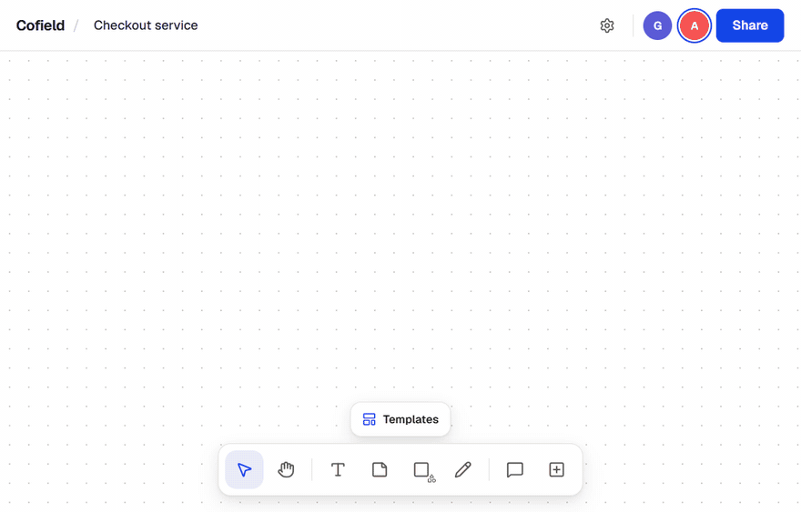
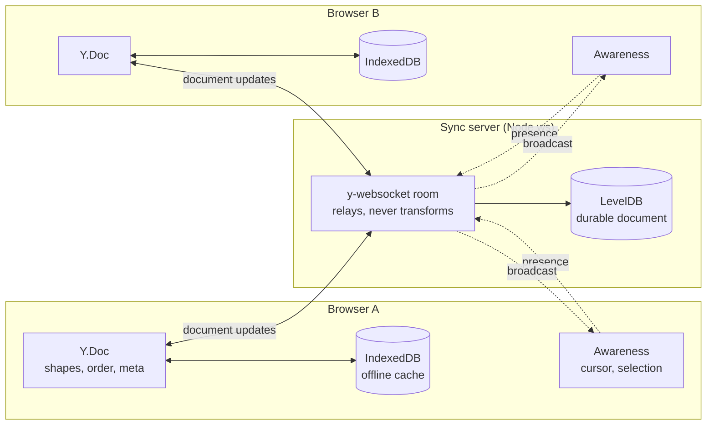

# Cofield

Cofield is an infinite collaborative canvas where several people draw on the same board at the same time, built on a CRDT instead of a central authority.

[](https://github.com/zanasalimi/cofield/actions/workflows/ci.yml)
[](LICENSE)

[Case study](https://www.zanastack.com/projects/cofield) · why the server is not allowed to decide who wins.



Two signed-in accounts, two browsers, one board. Half of what appears on that canvas arrives over the websocket from the other session, moving cursor included.

There is no hosted demo. Cofield is a web app plus a sync server, and both are needed for the thing worth demoing, so it runs locally: [two commands](#running-locally), two browser tabs.

## The problem

Two people drag the same shape at the same moment. Under last-write-wins one of those edits simply disappears, and neither person is told. Operational transform avoids that by having a server rewrite every operation against every other operation, which is hard to implement correctly and makes that server the one thing every client depends on. Now put one of those people on a train with no signal for ten minutes, and the question stops being about latency: it is about how two histories that diverged become one again without a human arbitrating.

## Architecture


```mermaid
flowchart LR
  subgraph A["Browser A"]
    ADoc["Y.Doc<br/>shapes, order, meta"]
    AAw["Awareness<br/>cursor, selection"]
    AIdb[("IndexedDB<br/>offline cache")]
  end

  subgraph SRV["Sync server (Node ws)"]
    Relay["y-websocket room<br/>relays, never transforms"]
    Level[("LevelDB<br/>durable document")]
  end

  subgraph B["Browser B"]
    BDoc["Y.Doc"]
    BAw["Awareness"]
    BIdb[("IndexedDB")]
  end

  ADoc <--> AIdb
  BDoc <--> BIdb
  ADoc <-->|document updates| Relay
  BDoc <-->|document updates| Relay
  Relay --> Level
  AAw -.->|presence| Relay
  BAw -.->|presence| Relay
  Relay -.->|broadcast| AAw
  Relay -.->|broadcast| BAw
```

Solid edges carry the document and end up on disk. Dotted edges carry presence, which is broadcast and then forgotten. The fuller system design is in [docs/ARCHITECTURE.md](docs/ARCHITECTURE.md).

## Key technical decisions

### A CRDT rather than operational transform or locking

The board is a Yjs document replicated in full to every client, and `server/index.ts` is a relay: it runs the y-websocket sync protocol, broadcasts what it receives, and writes updates to LevelDB. It never inspects or rewrites an operation. That is what makes offline editing possible at all, and it means no client is waiting on a server to decide whose change was legal.

The cost lands in two places. Deletes leave tombstones, because a CRDT has to remember that something was removed in order to converge with a peer that never heard about it, and Cofield has no snapshotting or garbage collection yet, so a heavily edited board grows. And since the server is not an authority, permissions cannot be enforced by validating intent. A viewer is held read-only in `server/readonly.ts` by decoding each frame and dropping sync step-2 and update messages before they reach the shared document, which is a blunter tool than an OT server would have.

### Yjs rather than Automerge or a hand-rolled CRDT

Four things in this codebase depend on Yjs specifically. Its updates are binary diffs exchanged against a state vector, so a client returning after ten minutes offline sends and receives only what the other side is missing rather than a whole board. Its nested types let each shape be a `Y.Map` with one key per field (`src/collab/doc.ts`), which is what makes "you moved it while I recoloured it" merge instead of one of us losing. The Awareness protocol ships with it and rides the same socket, so presence needed no second transport. And `Y.UndoManager` filters by transaction origin, so `createUndoManager` gives per-user undo without any bookkeeping: local edits carry a null origin and are tracked, updates arriving from the provider carry the provider as origin and are ignored, so Ctrl+Z never reverts a colleague's work.

The trade-off is a sharp edge Yjs is known for. It refuses to run with two copies of itself in one process, which is why `server/index.ts` deliberately imports only the `yjs` bundled inside y-websocket instead of adding its own.

### Offline editing and merge on reconnect

`src/collab/offline.ts` binds the same `Y.Doc` to IndexedDB under a per-board key, so edits made while disconnected go into the ordinary document rather than a queue of pending intentions. There is no replay step and no conflict prompt on reconnect. y-websocket sends sync step 1, which is a state vector describing what this client already has; the server answers with just the operations it is missing, and the client sends its own the same way. Both sides end up with every edit, and the deterministic merge order is a property of the data structure, not of who reconnected first. `tests/crdt-merge.test.ts` pins this without a browser or a network.

The IndexedDB cache is the one part that can genuinely fail, in a private window or where site data is blocked. When it does, the board still syncs over the socket, so Cofield degrades to memory-only and says so rather than quietly dropping the durability guarantee.

### Presence on the awareness channel, never in the document

Cursors, selections, and viewports go to Awareness only (`src/collab/awareness.ts`), throttled to one update every 40ms, and the sync server persists the document alone. Presence is written at pointer frequency and is worthless a second later, so storing it would grow the document without bound and replay stale cursors on the next load. Keeping it separate also means a disconnected user's cursor disappears on an awareness timeout instead of lingering as a ghost.

The cost is that presence has no history: there is no record of who was looking at what, and nothing survives a refresh. `tests/collab/presence-isolation.test.ts` asserts the boundary holds, because it is a one-line mistake to cross.

## Running locally

Node 24+ and [pnpm](https://pnpm.io). Cofield is two processes: the Next.js app and the Yjs sync server.

```bash
git clone https://github.com/zanasalimi/cofield.git
cd cofield
pnpm install

pnpm sync    # terminal 1: ws relay on :4321, LevelDB in ./data
pnpm dev     # terminal 2: the web app on :3000
```

Sign up at <http://localhost:3000>, then open <http://localhost:3000/board/demo> in a second tab to see multiplayer. Every board needs an account, the shared demo included: it joins you on first visit, while every other board is gated on membership. SQLite tables are created on first run, so there is no migration step, and the defaults need no `.env.local` (copy `.env.example` only when the sync server is not on `localhost:4321`).

`docker compose up` runs both services with the same result and keeps LevelDB in a named volume.

`pnpm test` runs 63 deterministic tests with no DOM and no network, including two clients converging under concurrent edits, offline edits merging both ways on reconnect, and the transport reporting a revoked room instead of retrying forever.

## License

MIT, 2026 Zana Salimi. See [LICENSE](LICENSE).
