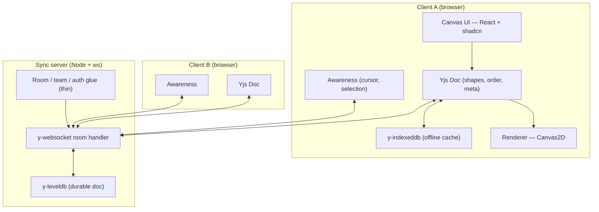
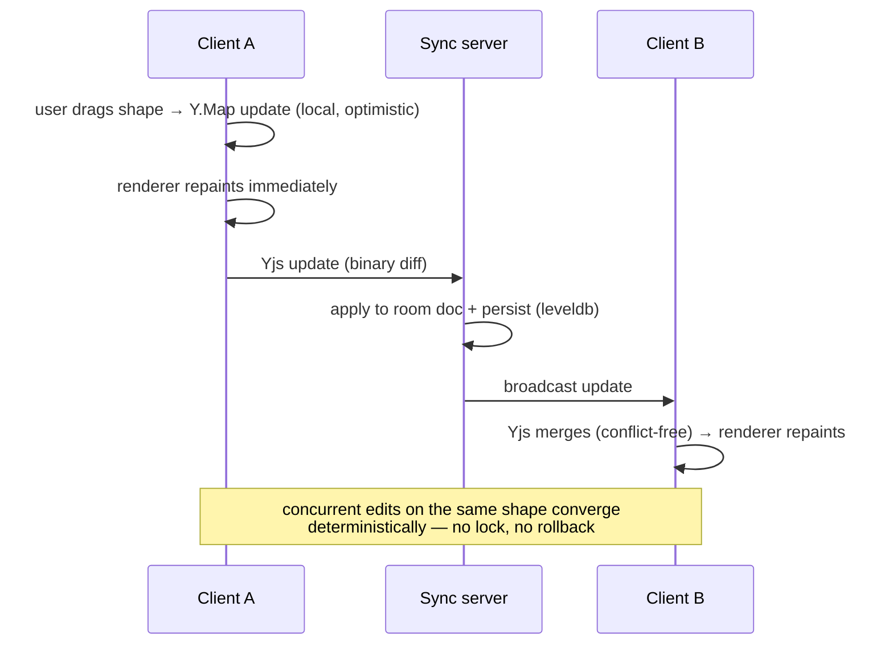
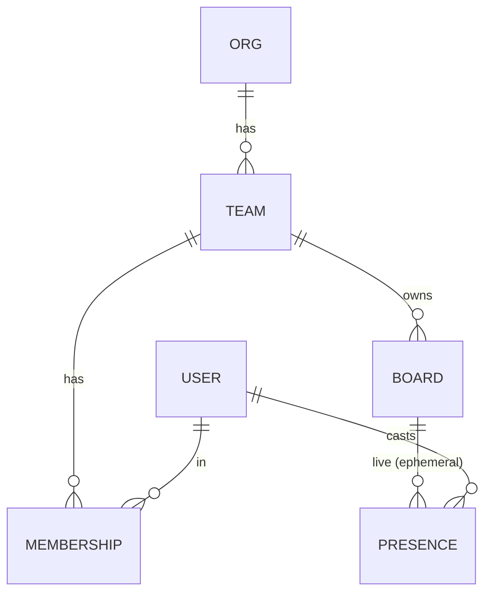

# Architecture

Cofield is an infinite collaborative canvas. The defining constraint: multiple people across multiple teams edit the same board concurrently, including while offline, and every client must converge on identical state with no data loss. This document explains how the pieces fit, how an edit moves through the system, and where the time goes.

## The one idea everything follows from

**The Yjs document is the source of truth, and it is replicated — not centralized.** Each connected client holds a full, convergent copy of the board. The server is a relay plus a durable store; it does not transform operations and is not an authority. This is the deliberate opposite of an operational-transform design, where a central server rewrites every op against concurrent ones. Here, conflict resolution is a property of the data structure (a CRDT), so it happens identically on every client without coordination.

A second idea rides alongside the first: **presence is not document state.** Cursors and selections are high-frequency and ephemeral. They travel on the same socket but on a separate Awareness channel that is never persisted. Writing a cursor position into the document would bloat it and replay stale cursors on the next load.

## System context



The crux is that the client boxes are nearly symmetric with the server: each holds the same document type. The server's extra job is durability (leveldb) and routing (which socket belongs to which room).

## Module breakdown

| Module | Responsibility | Pure / unit-tested |
| --- | --- | --- |
| `app/` | Next.js routes: landing, `board/[boardId]`, `team/[teamId]`. SSR shell, client canvas. | no |
| `src/canvas/Canvas.tsx` | The viewport surface: owns the `<canvas>`, routes pointer/keyboard events to the active tool. | no |
| `src/canvas/renderer/` | `Renderer` interface + `Canvas2DRenderer`. The WebGL path implements the same interface. | partial |
| `src/canvas/tools/` | Tool state machine — select, draw, shape, text, pan. Each tool is a small reducer. | yes (logic) |
| `src/canvas/geometry/` | Hit-testing, marquee intersection, resize/rotate transforms, snapping. Pure functions in world space. | **yes** |
| `src/canvas/viewport/` | Pan/zoom, world↔screen transforms, viewport culling. | **yes** |
| `src/collab/doc.ts` | Yjs doc setup and typed shape helpers (the nested-`Y.Map`-per-shape model). | **yes** |
| `src/collab/provider.ts` | WebSocket provider behind a `SyncProvider` interface (swappable transport). | partial |
| `src/collab/awareness.ts` | Read/write presence on the Awareness channel; throttle outgoing cursor updates. | partial |
| `src/collab/offline.ts` | `y-indexeddb` wiring for the offline cache + instant load. | no |
| `src/presence/` | Cursor layer, selection tints, avatar stack — renders ephemeral state. | no |
| `src/store/` | Zustand: active tool and UI-only state. Never the document. | yes (logic) |
| `src/ui/` | Re-themed shadcn primitives (toolbar, popover, dialog, avatar, command). | no |
| `server/index.ts` | `ws` server, room routing, wires persistence + awareness per room. | no |
| `server/persistence.ts` | `y-leveldb` bind/unbind, snapshot hooks. | no |
| `server/rooms.ts` | Room/team/auth glue; maps a socket to a board room. | yes (logic) |

The clean split is the headline: `src/collab/` and `src/canvas/geometry/` are **pure** and tested without a browser, because CRDT convergence and hit-testing are exactly the things worth proving deterministically.

## Data model

### Persistent — the Yjs document (converges across clients)

```
Y.Doc
  shapes : Y.Map<ShapeId, Y.Map<field, value>>   // each shape is a nested Y.Map
  order  : Y.Array<ShapeId>                       // z-order
  meta   : Y.Map<string, unknown>                 // board name, background, etc.
```

```ts
interface Shape {
  id: string;
  type: "rect" | "ellipse" | "arrow" | "draw" | "sticky" | "text";
  x: number; y: number; w: number; h: number; rotation: number;
  style: { fill: string; stroke: string; strokeWidth: number };
  content?: string;   // sticky / text
  points?: number[];  // freehand
  createdBy: string;
}
```

**Why each shape is a nested `Y.Map` and not a plain object in one big map:** if a shape were a single value, two users editing different fields of it concurrently — one drags it (changes `x`/`y`), the other recolors it (changes `style.fill`) — would clobber each other on merge. As a nested `Y.Map`, each field is an independently mergeable CRDT register, so both edits survive and the shape converges to "moved *and* recolored." This granularity is the part that proves real CRDT understanding rather than library use.

### Ephemeral — Awareness (never persisted)

```ts
interface Presence {
  userId: string;
  name: string;
  color: string;                              // one of 8 stable hues; drives cursor + tint
  cursor: { x: number; y: number } | null;    // world coords
  selection: string[];                        // shape ids
}
```

## How an edit moves through the system



The local edit is optimistic and repaints on the same frame; the network round-trip is off the interaction's critical path. When Client B receives the diff, Yjs merges it into B's copy by CRDT rules — the same rules A applied — so both end identical regardless of message order or concurrency.

## Multi-team model (v1)



Org → Team → Board is a product dimension most canvas clones skip. Team membership scopes which boards a user sees; presence is scoped per board and visually distinguishes teammates. `PRESENCE` is dashed-in here as a relationship but it is **never stored** — it exists only as live Awareness state for the duration of a session.

## Performance model — where the time goes

The hot path is the paint loop, and the headline optimization is **viewport culling**.

- **World vs screen separation.** All geometry — positions, sizes, hit-tests, transforms — is computed in world coordinates. The viewport applies a single transform (pan + zoom) only at render time. This keeps selection and resize math correct at any zoom and means a pan/zoom is a transform change, not a data change.
- **Viewport culling.** A board with 1000+ shapes cannot repaint every shape every frame. Each frame, only shapes whose world-space bounds intersect the visible rectangle are drawn. Culling is a spatial query against the viewport rect; everything off-screen costs nothing.
- **Dirty-rect repaint.** When a small region changes (a cursor moves, one shape nudges), repaint only the affected rectangle rather than the whole canvas.
- **Cursor throttling + interpolation.** Outgoing cursor updates are throttled to ~30–60 ms on the Awareness channel; receivers interpolate between samples so motion looks smooth without flooding the socket. Presence never touches the document, so it never triggers a doc diff.
- **Renderer interface.** Canvas2D ships the MVP. Because culling and the world/screen split already exist, a `WebGLRenderer` implementing the same `Renderer` interface drops in for 10k+ shapes without changing tool or geometry code.

### Document growth and tombstones (the honest cost)

CRDTs accumulate tombstones for deleted items so that concurrent operations referencing them still resolve. Left unbounded, the document grows. The mitigation is periodic **snapshotting** (compact the current state) and optional document **GC**, accepting the tradeoff that GC can complicate very-late-arriving offline edits. This is recorded honestly in [DECISIONS.md](DECISIONS.md) rather than hand-waved.

## Failure and recovery

- **Disconnected.** The client keeps editing against its local doc and `y-indexeddb` cache. The UI shows a clear disconnected state; no edits are lost.
- **Reconnecting.** On reconnect, Yjs exchanges state vectors and syncs only the diff in both directions. Offline edits merge with edits made by others while away.
- **Server restart.** leveldb holds the durable doc; a restarted server rehydrates each room's document from disk, so clients resync to the persisted state rather than an empty board.
- **Conflicting concurrent edits.** Resolved by CRDT merge, deterministically, with no lock and no rollback.

## Deployment topology

Two services, modeled exactly in `docker-compose.yml`:

- **web** — Next.js standalone output on `node:24-alpine`, served on `:3000`.
- **sync** — the Node `ws` + Yjs relay on `:1234`, with the leveldb store on a named `canvas-data` volume so boards survive `docker compose restart`.

`NEXT_PUBLIC_WS_URL` tells the browser where to reach the sync service. In production the web app deploys to a serverless host while the sync server runs on a small always-on host (it holds long-lived sockets and a durable store, so it cannot be serverless).
